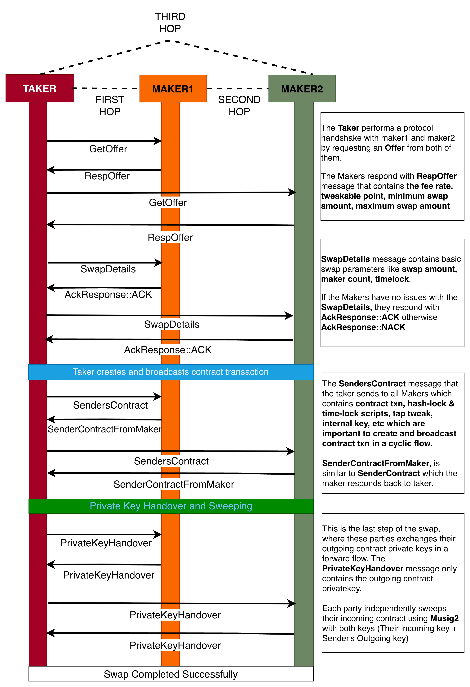

# Protocol Flow

This section outlines the step-by-step process of how a Taproot-based Coinswap is performed, detailing the actions taken by the taker and the makers. Each stage involves a series of interactions between the participants, culminating in the successful completion of the swap.

  

